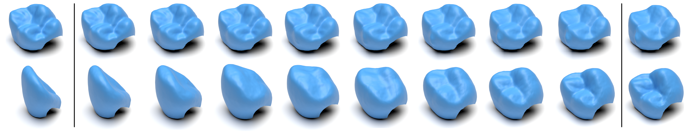

# Variational Autoencoding of Dental Point Clouds

[Paper](https://arxiv.org/abs/2307.10895) | [Data](https://data.dtu.dk/articles/dataset/3Shape_FDI_16_Meshes_from_Intraoral_Scans/23626650)


## Requirements:
Code was run and tested on
```
python=3.9
pytorch=1.9.1
h5py=3.10
nflows=0.14
pyntcloud=0.3
scikit-learn=1.3
tqdm=4.66
plyfile=1.0
gitpython=3.1
tensorboard=2.16
setuptools==59.5.0
```
Metrics are an updated version of [SetVAE's metrics](https://github.com/jw9730/setvae) for python 3.9 (for other versions, simply edit line 77-78 in the MakeFile). Install them via:

```
bash ./install.sh
```

Code was tested on Ubuntu 22.04 using CUDA 11.8. 

If anything goes wrong during installation, it can be helpful to delete .cache/torch_extentions folder for a clean build


## Data
FDI 16 data can be downloaded [here](https://data.dtu.dk/articles/dataset/3Shape_FDI_16_Meshes_from_Intraoral_Scans/23626650), both as meshes and point clouds. 

## Checkpoint
Checkpoint can be downloaded from [here](https://www.dropbox.com/scl/fo/kd2escsxqz9qz4l94t53t/h?rlkey=capz37u9a3a7d3snz8to5di92&dl=0)

## Training
VAE training can be run using
```
python ./main.py --x_train path_to_train_data --x_val path_to_val_data 
```

Flow prior training can be run using:
```
python ./train_sampling.py --x_train path_to_train_data --x_val path_to_val_data  --x_test path_to_test_data --model_path path_to_vae_ckpt --test_name insert_test_name --seed insert_seed_num
```

## Citation
```
@misc{ye2024variational,
      title={Variational Autoencoding of Dental Point Clouds}, 
      author={Johan Ziruo Ye and Thomas Ørkild and Peter Lempel Søndergaard and Søren Hauberg},
      year={2024},
      eprint={2307.10895},
      archivePrefix={arXiv},
      primaryClass={cs.CV}
}
```
